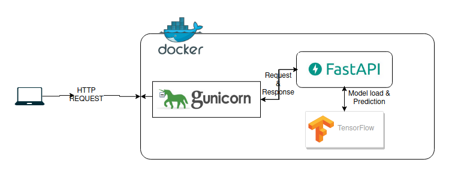
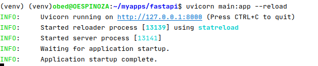
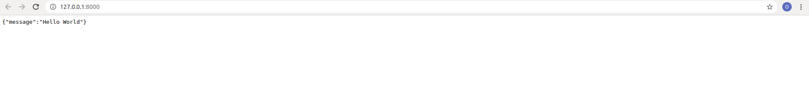
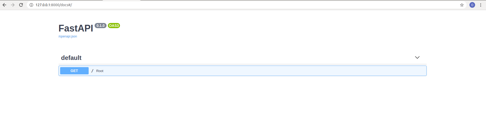
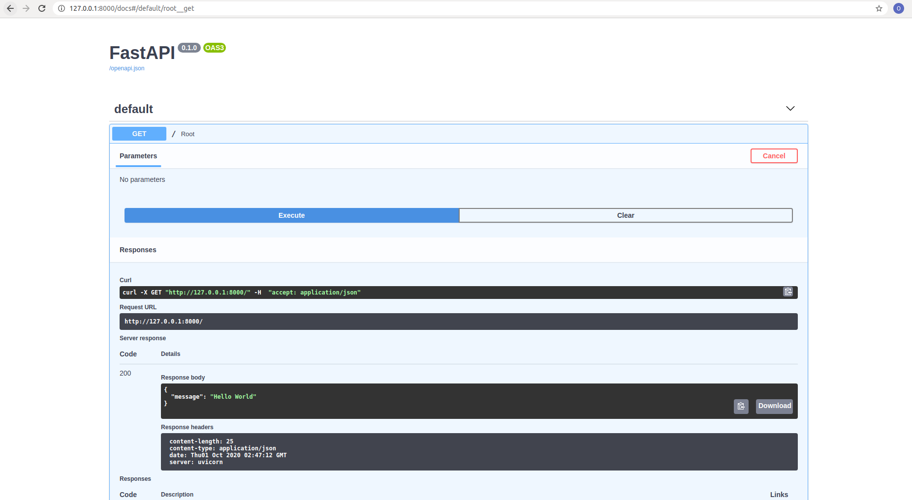
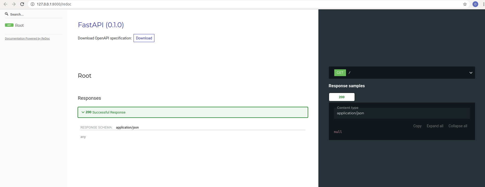
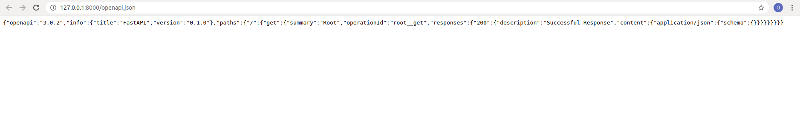

# FAST API
Fast API is a framework, high performance, easy to learn, fast to code and ready for production.

It's intended as easy solution for building web services using Python.

The framework is marketed as:

- **Fast**
- **Fast to Code**
- **Fewer Bugs**
- **Intuitive**
- **Easy**
- **Short**
- **Robust**
- **Standard-Based**

You can check further in [here](https://fastapi.tiangolo.com/).

**Framework**: if you are wondering, it's just a platform for developing software applications. You can read further [here](https://techterms.com/definition/framework#:~:text=A%20framework%2C%20or%20software%20framework,programs%20for%20a%20specific%20platform).

## Unicorn - Web Service

Fast Api uses **Unicorn** as web service, which is a lightning-fast ASGI server implementation, using [uvloop](https://github.com/MagicStack/uvloop) and [httptools](https://github.com/MagicStack/httptools).

Wow what is uvloop, is just a replacement for asyncio, which is the main library to use asynchronous functions. If you wish to know more you can read [here](https://docs.python.org/3/library/asyncio.html).

Httptools, is an implementation of http parsers similar to the ones used in NodeJs.



## Requirements

So far FastApi only requires python 3.6+, but you can always check the official documentation [here](https://fastapi.tiangolo.com/#requirements).

## Let's start

So far we have an idea what's FastApi, let's get our hands dirty.

### Installation

To install we first recommend you create a virtualenv in your desire folder. You can read how to create a virtualenv [here](https://docs.python.org/3/library/venv.html).

Then you just need to copy the following code:

```python
pip install fastapi[all]
```

Using the all suffix guarantees that all the posible dependencies are met. You can always check for a minimun installation if you wish.

### Our Fist App

Create a new file called `main.py` and copy the following code:

```python
from fastapi import FastAPI

app = FastAPI()


@app.get("/")
async def root():
    return {"message": "Hello World"}
```

Now to run the service we need to copy the following code into a console:

```bash
uvicorn main:app --reload
```

What does this command do? 

- Executes `uvicorn` service.
- Tells `uvicorn` to look for the file `main.py` with the `main` command.
- after the colon we indicate the object that creates the FastApi, in this case `app`
- `--reload` allow the service to reloads every time the code changes. This is only recommended in development stage.

The output should be: 



When open the browser:



### Swagger UI

This is great our first `Hello World`. But that's not all, fastApi already comes with [**Swagger UI**](https://swagger.io/tools/swagger-ui/) as documentation for the service. This could be accessed in the following URL:

```
http://127.0.0.1:8000/docs
```

The output is:



The great thing about swagger, is that we can try the service there just by expanding the verb and clicking the button `Try it Out`:

.

The Great thing about swagger is that you can customize the view, according your company standard, you can read further [here](https://swagger.io/docs/open-source-tools/swagger-ui/customization/custom-layout/).


### ReDoc

You don't like **Swagger ui**, well you can use [**ReDoc**](https://swagger.io/blog/api-development/redoc-openapi-powered-documentation/). You can access ReDoc

```
http://127.0.0.1:8000/redoc
```

You get the following:



### OpenApi

[OpenApi](https://github.com/OAI/OpenAPI-Specification) is an agnostic programming language standard for defining HTTP APIs, which allows humans and computers to discover and understand the capabilities of a service withoug requiring accesso to the source code, additional documentation, or inspect of network traffic.

**FastApi** automatically generates the OpenApi Schema, you can access it in the following URL:

```
http://127.0.0.1:8000/openapi.json
```




### Understading the main.py

Well we have a better idea of we can accomplish with FastApi, let's check what the code in the `main.py` means:

```python
from fastapi import FastAPI

app = FastAPI()


@app.get("/")
async def root():
    return {"message": "Hello World"}
```

- The first line, we are just importing the FastAPI class, which is the one that provides all the functionality you need for your API.
- The second line, we just create the API main object and assign it to a variable, the standard is to name this variable `app`, but you can use whatever you want. Just remember this is the name you need to use when you start the `uvicorn` service.
- The third line, using the `app` variable we define 2 thing here:
  - A GET verb method. If you wan to read about HTTP methods you can check [here](https://www.restapitutorial.com/lessons/httpmethods.html#:~:text=The%20primary%20or%20most%2Dcommonly,but%20are%20utilized%20less%20frequently.).
  - The path of the verb, for this example we use only the `/`, but as our api growns we will define further more routes.
- The fourth line, defines the function to execute when the request matches the verb method and url we define. In this scenario is defined as an asynchronous function, but you can always define it as a normal function. As usual you can read further [here](https://fastapi.tiangolo.com/async/#in-a-hurry).

let's move fordward to more sophisticated ways to create paths.

### Parameters

When creating an API we have several ways to obtain parameters from the user request, these are:

- Header Parameters. You can read further [here](https://www.soapui.org/learn/api/understanding-rest-headers-and-parameters/).
- Path Parameters. You can read further [here](https://rapidapi.com/blog/api-glossary/parameters/path/).
- Query Parameters. You can read further [here](https://branch.io/glossary/query-parameters/)

#### Path Parameters

In FastApi we can define Path Parameters with the following code:

```python
@app.get("/items/{item_id}")
async def read_item(item_id):
    return {"item_id": item_id}
```

We can add a easy validation just by adding the Type of the variable.

```python
@app.get("/items/{item_id}")
async def read_item(item_id: int):
    return {"item_id": item_id}
```

##### Order Matters

Keep in mind the order you define the endpoints matter, for example if you have the following paths:

```python
@app.get("/users/me")
async def read_user_me():
    return {"user_id": "the current user"}


@app.get("/users/{user_id}")
async def read_user(user_id: str):
    return {"user_id": user_id}
```

This will only work if you define the static path `/users/me` first, otherwise it will always resolve with the path `/users/{user_id}` whetere if you add the `me` suffix or other.

##### Defined Values

If we want to define a limit set of values we can pass into the service, we can define an Enum (Enumerator), and the service will validate that you only provide those values.

```python
class ModelName(str, Enum):
    alexnet = "alexnet"
    resnet = "resnet"
    lenet = "lenet"
```

```python
@app.get("/model/{model_name}")
async def get_model(model_name: ModelName):
    if model_name == ModelName.alexnet:
        return {"model_name": model_name, "message": "Deep Learning FTW!"}

    if model_name.value == "lenet":
        return {"model_name": model_name, "message": "LeCNN all the images"}

    return {"model_name": model_name, "message": "Have some residuals"}
```

#### Query Parameters

When you declare other function parameters that are not part of the path parameters, they are automatically interpreted as "query" parameters.

```python
fake_items_db = [{"item_name": "Foo"}, {"item_name": "Bar"}, {"item_name": "Baz"}]
```

```python
@app.get("/items/")
async def read_item(skip: int = 0, limit: int = 10):
    return fake_items_db[skip : skip + limit]
```

##### Optional Query Parameters

```python
@app.get("/items/{item_id}")
async def read_item(item_id: str, q: Optional[str] = None):
    if q:
        return {"item_id": item_id, "q": q}
    return {"item_id": item_id}
```

#### Mixing Path and Query Parameters

```python
@app.get("/users/{user_id}/items/{item_id}")
async def read_user_item(
    user_id: int, item_id: str, q: Optional[str] = None, short: bool = False
):
    item = {"item_id": item_id, "owner_id": user_id}
    if q:
        item.update({"q": q})
    if not short:
        item.update(
            {"description": "This is an amazing item that has a long description"}
        )
    return item
```

### Request Body

When you need to send data from a client (let's say, a browser) to your API, you send it as a request body.

A request body is data sent by the client to your API. A response body is the data your API sends to the client.

Your API almost always has to send a response body. But clients don't necessarily need to send request bodies all the time.

To declare a request body, you use [Pydantic](https://pydantic-docs.helpmanual.io/) models with all their power and benefits.sing

Using the POST verb:

```python
from typing import Optional

from fastapi import FastAPI
from pydantic import BaseModel


class Item(BaseModel):
    name: str
    description: Optional[str] = None
    price: float
    tax: Optional[float] = None


app = FastAPI()


@app.post("/items/")
async def create_item(item: Item):
    return item
```

Using the PUT verb:

```python
@app.put("/items/{item_id}")
async def create_item(item_id: int, item: Item):
    return {"item_id": item_id, **item.dict()}
```